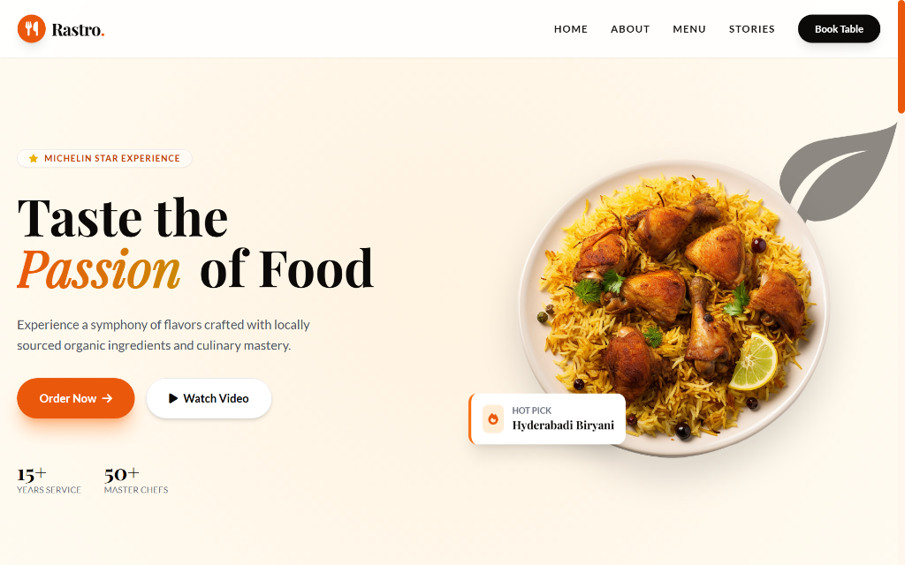
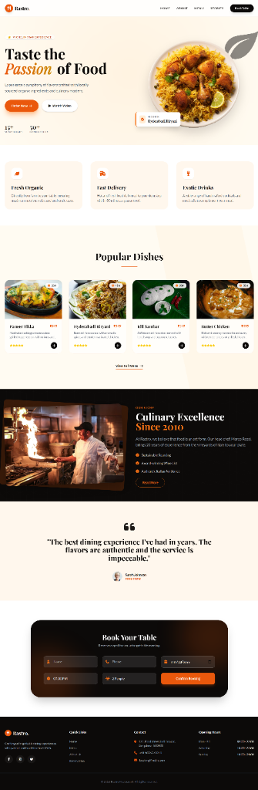

# Rastro | Premium Dining

Experience the passion of food with **Rastro**. A modern, responsive restaurant website featuring a premium design, glassmorphism aesthetics, interactive elements, and a smooth user experience. Tailored for a high-end dining audience in India.

## 📸 Preview



<details>
<summary><strong>View Full Page Screenshot</strong></summary>



</details>

## ✨ Features

- **Premium Design**: Glassmorphism, custom animations, and a curated color palette (Burnt Orange & Fresh Green).
- **Responsive Layout**: Fully responsive design optimized for mobile, tablet, and desktop.
- **Interactive Elements**: Hover effects, scroll animations (Intersection Observer), and a smooth mobile menu.
- **Fast Performance**: Optimized for speed with lightweight assets and smooth transitions.
- **Localized Experience**: Tailored for the Indian market with authentic menu items (Hyderabadi Biryani, Idli Sambar) and localized content.
- **Performance Optimized**: Implements lazy loading for images, LCP preloading, and minified CSS assets.

## 🛠️ Tech Stack

- **HTML5**: Semantic structure and modern tags.
- **Tailwind CSS**: Utility-first styling with a custom configuration and minified build output.
- **Vanilla JavaScript**: Lightweight logic for mobile menu toggling and scroll animations.
- **Font Awesome**: Scalable vector icons for visual cues.
- **Google Fonts**: 'Playfair Display' for elegant headings and 'Lato' for readable body text.

## 📂 Project Structure

```bash
Rastro/
├── assets/
│   ├── biryani.png      # Optimized hero image
│   ├── hero-preview.png
│   └── full-preview.png
├── src/
│   └── input.css        # Tailwind source CSS
├── index.html           # Main application file
├── style.css            # Compiled & Minified CSS
├── tailwind.config.js   # Tailwind configuration
└── README.md            # Project documentation
```

## 🚀 Installation

1.  Clone the repository:
    ```bash
    git clone https://github.com/codebysrk/Rastro.git
    ```
2.  Navigate to the project directory:
    ```bash
    cd Rastro
    ```
3.  Open `index.html` in your web browser.

## License

This project is open source and available under the [MIT License](LICENSE).
